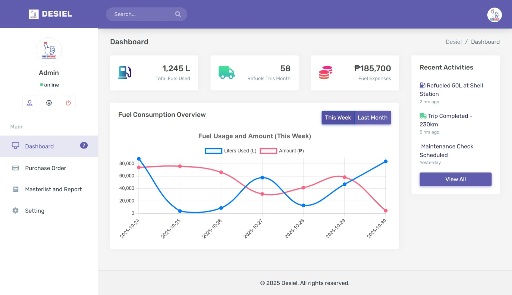
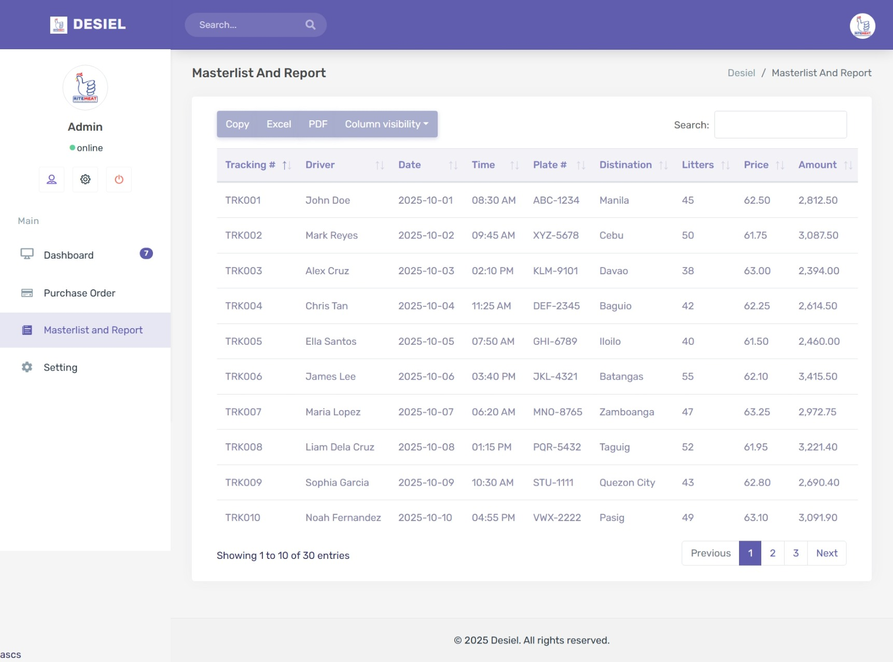
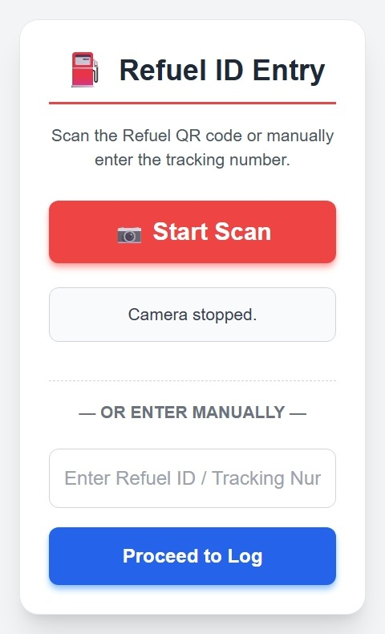

# 🚛 Diesel Monitoring System

The **Diesel Monitoring System** is a responsive, web-based management tool designed to track and manage diesel fuel usage for transport vehicles. It provides fleet managers with transparent reports on driver activity, fuel consumption, and operational expenses for efficient fleet operations.

---

## 📸 System Overview

Get a quick look at the main system dashboard:



---

## 🧩 Features

### 🔹 Dashboard
- Overview of daily, weekly, and monthly fuel usage.
- Summary of total liters consumed and total cost.
- Real-time transport and fuel data visualization.

### 🔹 Masterlist and Fuel Logging
- Record and view all diesel transactions with detailed metrics (tracking number, driver, destination, liters, price, etc.).
- **New!** Supports logging new transactions quickly via **QR Code scanning** (e.g., of a driver ID or vehicle tag).
- Supports instant table export to **Excel** (XLSX) for reporting.



### 🔹 File Management
- Upload and update company logo using **Dropify**.
- Change admin credentials through the **Update Password** section.

### 🔹 Reports
- Generate reports for auditing and budget tracking.
- Filter records dynamically by date range, driver, or destination.

### 🔹 Security
- Password update and **CSRF protection** for form submissions.
- Input validations using **Parsley.js** for reliable data entry.

---

## ✨ New Feature: QR Code Diesel Logging

To streamline the logging process, the system now supports **QR Code scanning**. This is primarily intended to:

1.  **Quickly identify** the driver or vehicle by scanning a pre-generated QR code (e.g., on an ID badge or vehicle sticker).
2.  **Pre-fill** the transaction form with the relevant Driver or Vehicle ID, reducing manual data entry and errors at the time of refueling.

The implementation is client-side, using a standard JavaScript library to access the device camera (where available) or to allow manual input based on a QR code lookup.


---

## 🖥️ Tech Stack

This project is built using a classic LAMP/WAMP/MAMP stack combined with modern frontend libraries.

| Layer | Technology | Description |
|-------|-------------|-------------|
| **Frontend** | HTML5, CSS3, Bootstrap 5, JavaScript (ES6) | Provides a responsive and modern user interface. |
| **Backend** | PHP 8+, MySQL / MariaDB | The core server-side logic and database engine. |
| **Data Tools** | DataTables, Dropify, Parsley.js, **zxing-js/library (for QR)** | Used for dynamic tables, file uploads, form validation, and **QR code scanning**. |
| **Export Tool** | SheetJS (XLSX.js) | Handles client-side exporting of table data to Excel files. |
| **Icons** | Material Design Icons, Feather Icons | Consistent and clean iconography. |

---

## ⚙️ Installation Guide

Follow these steps to get the Diesel Monitoring System running on your local machine.

### 1️⃣ Clone the Repository
Open your terminal and clone the project:
```bash
git clone [https://github.com/your-username/diesel-monitoring.git](https://github.com/your-username/diesel-monitoring.git)
````

### 2️⃣ Move Files to XAMPP / Laragon

Place the project folder inside your local server's document root (e.g., `htdocs` for XAMPP):

```
C:\xampp\htdocs\diesel-monitoring
```

### 3️⃣ Import Database

  \* Open **phpMyAdmin**.
  \* Create a new database (e.g., `diesel_db`).
  \* Import the provided SQL file (`diesel_db.sql`) into the new database.

### 4️⃣ Configure Database Connection

Edit the database configuration file at `includes/config.php` to match your local credentials:

```php
// Site configuration: make sure the name matches your folder name
define("SITE_NAME", "Desiel");
// Database name without prefix/suffix
define("DB_HOST", "localhost");
define("DB_USER", "root");
define("DB_PASS", "");
define("DB_NAME", "Desiel");
```

### 5️⃣ Run the Project

Open your browser and navigate to your local server path.

```
http://localhost/diesel-monitoring
```

-----

## 📦 Folder Structure

```
diesel-monitoring/
├── assets/
│   ├── css/          # Stylesheets
│   ├── js/           # Custom JavaScript files
│   ├── images/       # Project logos, dummy images
│   └── vendor/       # Third-party libraries (Bootstrap, DataTables, QR library, etc.)
├── includes/
│   ├── config.php    # Database connection file
│   ├── header.php    # Shared HTML header/navigation
│   ├── footer.php    # Shared HTML footer/scripts
├── pages/            # Core system pages
│   ├── dashboard.php
│   ├── purchase order.php
│   ├── masterlist-and-report.php
│   └── settings.php
├── index.php         # Login page
├── upload_logo.php   # Logo upload handler
├── update_password.php # Password update handler
├── diesel_db.sql     # Database dump file
└── README.md
```

-----

## 📊 Usage

The system is designed for a straightforward workflow:

1.  **Login** using admin credentials (to be defined in the `diesel_db.sql`).
2.  **Log a new transaction** by either:
\* **Scanning a QR Code** (to pre-fill driver/vehicle data).
\* Manually adding a new record via the **Masterlist** section.
3.  Monitor current and historical diesel usage and costs on the **Dashboard**.
4.  Generate specific audit reports using the date and driver filters in the **Reports** section.
5.  Update company logo and admin password under **Settings**.

-----

## 🧠 Developer Notes

  \* **Prerequisites:** Ensure you have **PHP 8+** and **MySQL/MariaDB** installed and running via XAMPP, Laragon, or a similar environment.
  \* **Browser Compatibility:** Use **Google Chrome** or **Edge** for the best rendering and performance. The QR scanner relies on modern browser APIs.
  \* **Permissions:** Recommended: enable file upload permissions for the `uploads/` directory if you encounter issues saving the company logo.

-----

## 👨‍💻 Author

**Kian Shim Diola**
📍 Philippines
💻 Full Stack Developer | System Designer
📧 [shimshimdiola@gmail.com](mailto:shimshimdiola@gmail.com)
🌐 [https://github.com/shimshimdiola](https://github.com/shimshimdiola)

```
```
